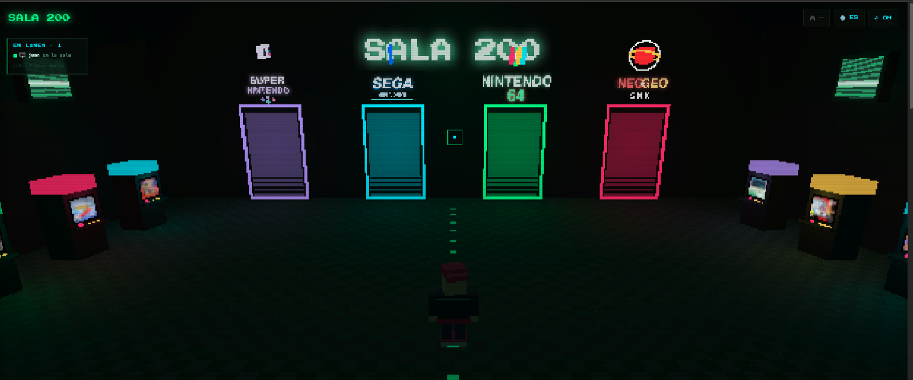
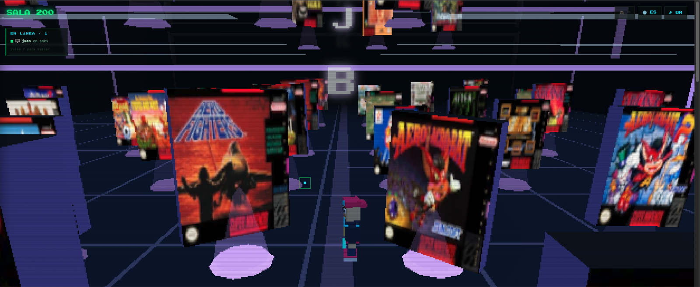
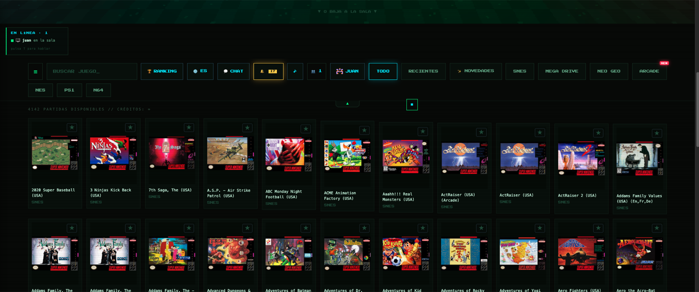
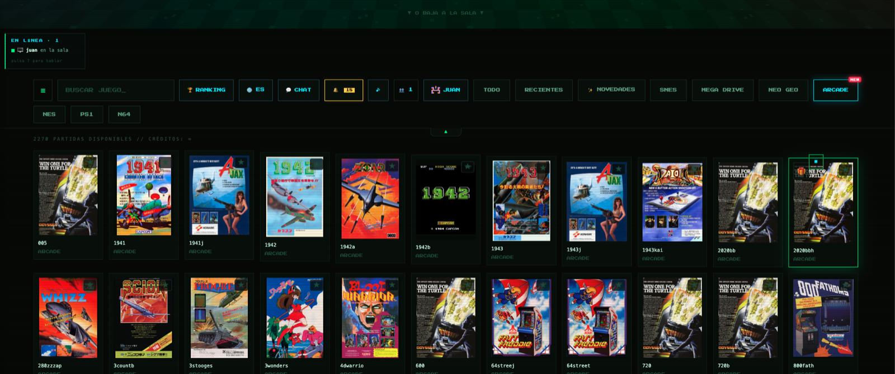
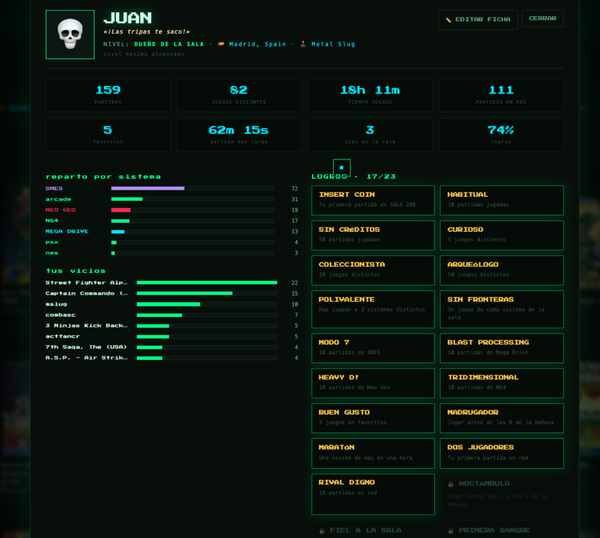
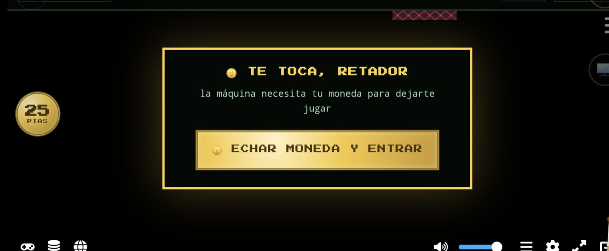
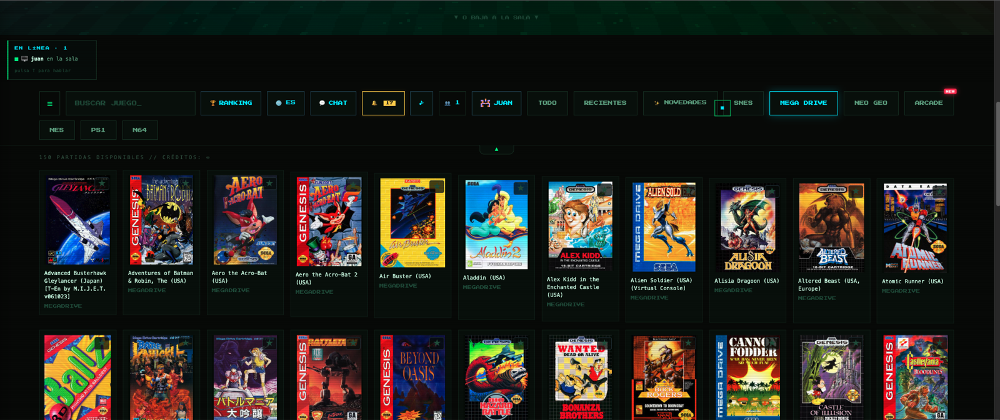
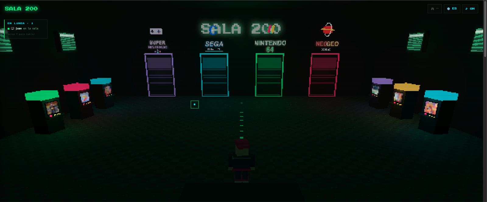

# SALA 200 🕹

**Self-hosted retro arcade with real browser netplay.** Play SNES, Mega Drive,
Neo Geo, arcade, N64 and NES in your browser, and run true 2-player online
matches where players connect **directly to each other** (WebRTC lockstep), not
through your server — so it scales to a whole club on a single Raspberry Pi.
Invitation-only membership, profiles with medals, spectator mode, gamepad
navigation and a 25-peseta coin for the INSERT COIN.
[Project page](https://ijuanlux.github.io/sala200/) · *(Spanish below)*

> No ROMs, no BIOS, no links to them. Bring dumps of the cartridges you own.


*The 3D lobby: each neon door is a system, and other members walk around it in real time.*


*Walk into a system's room and browse its games as giant lit-up boxes.*

| | |
|---|---|
|  |  |
| The library, with box art | 2270 arcade games, self-healing cores |
|  |  |
| Member card: levels, medals, war cry | Arcade netplay: the challenger inserts their coin |
|  |  |
| Every system gets its own shelf | Walk up to a door to browse that system |

---

Tu salón recreativo clandestino, montado en una Raspberry Pi. Emulación en el
navegador (SNES, Mega Drive, Neo Geo, arcade FBNeo, N64, PS1, Game Boy…),
**2 jugadores por internet** con netcode lockstep propio, perfiles con niveles
y medallas, invitaciones para tus colegas, moneda de 25 pesetas para el
INSERT COIN y frases de pique con voz. Sin cuentas de terceros, sin nube:
tu hardware, tus reglas.

> ⚠️ Este repo **no incluye ROMs ni BIOS** y no te dice dónde conseguirlas.
> Usa copias de tus propios cartuchos.

## Qué lleva dentro

| Carpeta | Qué es |
|---|---|
| `juegos/` | La web: lobby 3D, biblioteca, player con netplay lockstep, login y registro |
| `api/` | API Node sin dependencias (puerto 3011): perfiles, logros, presencia, invitaciones |
| `netplay/` | Relay de netplay (socket.io, puerto 3010), derivado del servidor de EmulatorJS |
| `catalogo/` | Scripts Python que escanean tus ROMs y generan el catálogo + carátulas |
| `deploy/` | nginx, unidades systemd, script de alta de usuarios |

## Quick start (Docker)

```bash
curl -fsSL https://raw.githubusercontent.com/ijuanlux/sala200/master/instalar.sh | bash
```

Or by hand:

```bash
git clone https://github.com/ijuanlux/sala200 && cd sala200
mkdir -p roms/SNES roms/MegaDrive roms/NeoGeo roms/Arcade   # your own dumps
SALA_ADMIN=juan SALA_PASS=secret SALA_SALT=$(openssl rand -hex 16) docker compose up -d
```

Open **http://localhost:8080**, log in with the member you just created, and put
your games under `roms/<System>/` — the catalogue rescans every 10 minutes.
Everything (web, profiles API and the netplay relay) runs in that single
container; your data lives in a Docker volume.

## Requisitos

- Raspberry Pi 4 (o cualquier Linux pequeño) con Raspberry Pi OS / Debian
- nginx, Node.js 18+, Python 3
- Un sitio con ROMs: carpeta local o NAS montado (CIFS/NFS)
- [Tailscale](https://tailscale.com) con Funnel si quieres jugar por internet (gratis)

## Montaje, paso a paso

### 1. Código y dependencias

```bash
sudo apt install nginx nodejs npm python3 unzip
git clone https://github.com/ijuanlux/sala200 && cd sala200
./descargar-libs.sh          # baja EmulatorJS (cores incluidos) y las libs del lobby
sudo mkdir -p /var/www/html/juegos /opt/sala200-api /opt/netplay /opt/sala200 /var/lib/sala200
sudo cp -r juegos/* /var/www/html/juegos/
sudo cp api/server.js /opt/sala200-api/
sudo cp -r netplay/* /opt/netplay/ && cd /opt/netplay && npm install socket.io express && cd -
sudo cp catalogo/* /opt/sala200/
sudo chown -R $USER /var/www/html/juegos /opt/sala200-api /var/lib/sala200
```

### 2. Elige tu SALT y crea el primer usuario

El acceso funciona con una cookie: `sha256("usuario:clave:SALT")`. Cambia el
SALT (la misma cadena en TRES sitios: `juegos/login.js`, `juegos/registro.js`
y `api/server.js`) y genera tu primer hash:

```bash
printf 'juan:miclave:MI-SALT-SECRETO' | sha256sum
```

- Mete el hash en `api/users.json` (copia `users.json.example`): `"<hash>": "juan"`
- Y en `deploy/sala200_map.conf`: `"<hash>" 1;   # juan`

El resto de usuarios entran solos con el sistema de invitaciones (cada socio
tiene 5, se generan desde el perfil).

### 3. Las ROMs y el catálogo

Monta tus ROMs donde quieras y ajusta `BASE` y `SOURCES` en
`catalogo/genlist.py` (una línea por estantería: sistema, carpeta,
extensiones). Luego:

```bash
python3 /opt/sala200/genlist.py     # genera juegos/games.json
python3 /opt/sala200/covers.py     # carátulas desde thumbnails.libretro.com (opcional)
```

Para Neo Geo necesitas `neogeo.zip` (BIOS) en la carpeta de Neo Geo.

### 4. nginx

```bash
sudo cp deploy/sala200_map.conf /etc/nginx/conf.d/
sudo cp deploy/nginx-sala200.conf /etc/nginx/sites-available/sala200
sudo ln -s /etc/nginx/sites-available/sala200 /etc/nginx/sites-enabled/
sudo rm -f /etc/nginx/sites-enabled/default
# ajusta el alias de /roms/ a tu carpeta de ROMs
sudo nginx -t && sudo systemctl reload nginx
```

### 5. Servicios

Las unidades están en `deploy/systemd-units.txt`: una para la API (3011),
otra para el netplay (3010), un timer que regenera el catálogo cada 10
minutos y un vigilante del túnel. Créalas en `/etc/systemd/system/`,
`daemon-reload` y `enable --now`.

Para el alta automática de invitados, la API necesita poder tocar el map de
nginx:

```bash
sudo cp deploy/sala200-alta /usr/local/sbin/ && sudo chmod 755 /usr/local/sbin/sala200-alta
echo "pi ALL=(root) NOPASSWD: /usr/local/sbin/sala200-alta" | sudo tee /etc/sudoers.d/sala200
```

### 6. Salir a internet (opcional)

```bash
sudo tailscale up
sudo tailscale funnel --bg 8080
```

Tu recreativa queda en `https://<maquina>.<tailnet>.ts.net`, con HTTPS de
verdad y sin abrir puertos en el router. El vigilante `sala200-funnel`
reinicia el túnel si tu operadora te cambia la IP.

## Lo que trae la v1.4

- **Netplay directo (P2P)**: los botones viajan de un jugador a otro por WebRTC;
  el servidor solo hace de casamentero. Escala sin límite y baja la latencia.
- **Modo palco**: un tercero ve la partida en directo (mismo savestate, mismos
  inputs) sin poder tocar.
- **Arcade con auto-curación**: prueba varios núcleos hasta dar con el que
  arranca cada ROM y lo recuerda para todos.
- **Club**: invitaciones (5 por socio), fichas con avatar/frase/país, niveles,
  medallas, duelos con confirmación cruzada, ranking con podio, chat con
  @menciones y buzón de novedades.
- **Modo sofá**: se navega toda la web con el mando; SELECT+START sale del juego.
- Y la peseta de 25, el pitillo humeando y las frases de pique.

## El netplay, en dos líneas

EmulatorJS trae un sincronizador experimental que no funciona; esta web lo
sustituye por un **lockstep determinista** propio, y desde la v1.4 los inputs
viajan además por un canal WebRTC directo entre jugadores: el anfitrión manda un
savestate (gzip) y a partir de ahí solo viajan botones, ejecutados en los
mismos frames en ambos lados. Margen adaptativo según tu latencia, batching
de mensajes, detección automática de desincronización por huella del estado,
pausa cortés si tu rival se va al WhatsApp y re-enganche automático. Los
detalles, comentados en `juegos/player.html`.

## Licencia

GPL-3.0. Construido sobre [EmulatorJS](https://emulatorjs.org) (GPL-3.0);
el relay de `netplay/` deriva de su servidor oficial. GSAP se descarga
aparte con su propia licencia.
